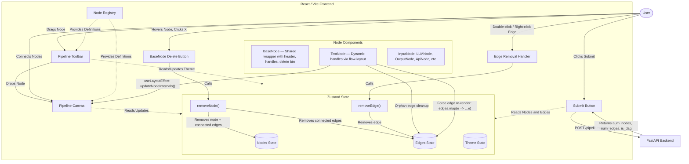

# Vector-shift
# VectorShift Frontend Architecture (AI Generated)

This document provides a clean, high-level overview of the frontend architecture for the VectorShift application.

## 1. High-Level Overview

The VectorShift frontend is a node-based visual pipeline editor. It allows users to construct workflow templates by dragging different types of nodes onto a canvas, connecting them via edges, and finally submitting the pipeline (the resulting Directed Acyclic Graph, or DAG) to a backend for parsing and validation.

## 2. Technology Stack

- **Framework**: React 18
- **Language**: TypeScript for static typing and interface definitions
- **Build Tool**: Vite (configured in `vite.config.ts`)
- **Styling**: Tailwind CSS v4 for utility-first styling and theming (light/dark mode)
- **State Management**: Zustand (with local storage persistence)
- **Canvas / Graph**: React Flow (v11) for rendering the interactive node graph
- **Icons**: Lucide React

## 3. Directory Structure

The project follows a feature-based folder structure, which keeps related files together and makes the codebase highly scalable.

```text
frontend/src/
├── App.tsx                     # Main layout wrapper (Toolbar, Canvas, SubmitButton)
├── main.tsx                    # React entry point
├── index.css                   # Global styles and Tailwind imports
├── components/                 # Shared UI components
│   ├── DraggableNode.tsx       # The draggable item used in the toolbar
│   └── SubmitButton.tsx        # Button to submit the pipeline to the backend
└── features/
    └── pipeline/               # Core feature: Pipeline Editor
        ├── components/
        │   ├── PipelineCanvas.tsx   # React Flow wrapper and drag-and-drop dropzone
        │   └── PipelineToolbar.tsx  # Top bar containing node templates to drag
        ├── nodes/              # Individual custom React Flow node components
        │   ├── BaseNode.tsx         # Shared node wrapper (handles, header, delete button)
        │   ├── TextNode.tsx         # Dynamic-handle node with variable parsing
        │   ├── ApiNode.tsx, LLMNode.tsx, InputNode.tsx, OutputNode.tsx, etc.
        ├── registry/
        │   └── nodeRegistry.ts      # Central registry mapping node types to definitions
        └── store/
            └── usePipelineStore.ts  # Zustand state for nodes, edges, and theme
```

## 4. Core Concepts & Architecture

### A. State Management (Zustand)

The entire state of the canvas is managed via a Zustand store (`src/features/pipeline/store/usePipelineStore.ts`).

- **State Properties**: `nodes`, `edges`, `nodeIDs` (for generating unique IDs), and `theme`.
- **Actions**: `addNode`, `onNodesChange`, `onEdgesChange`, `onConnect`, `updateNodeField`, `removeNode`, `removeEdge`, `toggleTheme`.
- **Persistence**: The state is wrapped in Zustand's `persist` middleware, meaning the pipeline graph is saved to `localStorage` (key: `vectorshift-pipeline-state`). The graph persists even if the user refreshes the page.

### B. The Node System & Registry

To maintain a clean separation of concerns, the app uses a **Node Registry** (`src/features/pipeline/registry/nodeRegistry.ts`).

- Instead of hardcoding available nodes in the UI, `NODE_REGISTRY` exports an array of node definitions (type, label, color, icon, component).
- The Toolbar iterates over this registry to generate the draggable icons.
- The Canvas uses this registry to dynamically register custom node types with React Flow (`reactFlowNodeTypes`).
- Adding a new node type simply requires creating the component in the `nodes/` folder and adding a single line to `nodeRegistry.ts`.

### C. Drag and Drop Architecture

1. **Drag Start**: The user clicks and drags a `DraggableNode` from the `PipelineToolbar`. It uses HTML5 `dragStart` to set the `application/reactflow` payload to the node's `type`.
2. **Drag Over**: The user drags the item over the `PipelineCanvas`.
3. **Drop**: The `onDrop` handler in `PipelineCanvas` captures the screen coordinates, projects them into React Flow canvas coordinates, generates a new sequential ID using `getNodeID` from the store, and calls `addNode` to append the new node to the Zustand store.

### D. Node & Edge Deletion

Users can remove nodes and connections through multiple interaction patterns:

- **Delete a Node**: Every node rendered through `BaseNode` displays an `✕` button in the header on hover. Clicking it calls `removeNode(id)`, which removes the node **and** all edges connected to it from the store in a single atomic update.
- **Delete an Edge (Double-click)**: Double-clicking any edge on the canvas calls `removeEdge(edge.id)` to remove it.
- **Delete an Edge (Right-click)**: Right-clicking an edge removes it and prevents the browser context menu from appearing.

### E. Dynamic Handles in TextNode

The `TextNode` component parses `{{variable}}` patterns from user input and dynamically creates a target (input) handle for each unique variable. Key design decisions:

- **Flow-Layout Handles**: Instead of absolute positioning with CSS `top: X%`, each handle is rendered inside a `position: relative` container in the normal document flow. This guarantees React Flow's `getBoundingClientRect()` always reads the correct handle position without timing issues.
- **Orphan Edge Cleanup**: When a variable is removed from the text, a `useLayoutEffect` checks for edges pointing to the deleted handle ID and removes them via `onEdgesChange`.
- **Forced Edge Re-render**: After calling `updateNodeInternals(id)`, the effect creates new edge object references (`edges.map(e => ({...e}))`) to force React Flow to recalculate all edge paths — a workaround for a React Flow v11 limitation where `updateNodeInternals` alone doesn't always trigger edge re-rendering.

### F. Backend Communication

The `SubmitButton` component pulls the current `nodes` and `edges` from the Zustand store and sends them as a JSON payload to a local FastAPI backend:

- **Endpoint**: `POST http://localhost:8000/pipelines/parse`
- **Payload**: `{ "nodes": [...], "edges": [...] }`
- **Response Handling**: The application alerts the user with statistics about the graph (number of nodes and edges) and importantly, whether the backend parsed it as a valid **Directed Acyclic Graph (DAG)**.

## 5. UI/UX and Theming

The application supports Light and Dark modes. The theme is tracked in the Zustand store and applied via a side-effect in `App.tsx` that attaches the `light` or `dark` class to the HTML document root. Styling heavily relies on CSS variables defined in `index.css` (e.g., `--color-bg-app`, `--color-border`) mapping to Tailwind utility classes.

## 6. System Design Diagram



